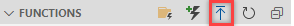

# SharePointOnlineActivityCounter
An Azure Function App to count activities on SharePoint Online

Once deployed, the function runs every 5 minutes to collect counts. Counts are separated by SharePoint or OneDrive.

## Requirements
* Azure Subscription
* Audit Log enabled for SharePoint and OneDrive
* VSCode with Azure Functions extension


## Setup Steps
### Create Azure Resources
1. Clone this repository and open in VSCode
   * You should see the functions listed in VSCode

        

2. Deploy the local project as a new Function App in Azure
    * Click on Deploy
        
    * Enter the function name, Runtime, and desired location

3. Create a Log Analytics Workspace
    * We will use the LAW to store counts collected by the Function App
4. Create a Storage Account
    * We will use the Storage Account to store configuration and timestamp json file.
5. In the storage account create a new blob container and a json file similar to the one below.
    ```JSON
    {
        "UserId": "username@contoso.com",
        "Operation": "FileDeleted",
        "LastTimeStamp": ""
    }
    ```
### Grant permissions for the Function App
1. Create a Managed Service Identity (MSI) for the Function App.
2. Set the MSI as Owner for the Service Account.
3. Configure the MSI as Compliance Administrator using below PowerShell commands
    ```PowerShell
    Install-Module -Name AzureAD
    Import-Module -Name AzureAD
    Connect-AzureAD #Connect using an account that has Global Admin permissions

    $AzureFunctionAppName = "<Azure Function App Name>"

    # Grant proper permissions for MSI for the Exchange.ManageAsApp API
    $O365ExoSP =  Get-AzureADServicePrincipal -Filter "DisplayName eq 'Office 365 Exchange Online'"
    $Permission = $O365ExoSP.AppRoles.Where({$_.Value -eq 'Exchange.ManageAsApp'})
    $AzureFunctionSP = Get-AzureADServicePrincipal -Filter "DisplayName eq '$AzureFunctionAppName'"
    New-AzureADServiceAppRoleAssignment -ObjectId $AzureFunctionSP.ObjectId -Id $Permission[0].Id -PrincipalId $AzureFunctionSP.ObjectId -ResourceId $O365ExoSP.ObjectId

    #Check if role is currently enabled
    $roleName = 'Compliance Administrator'
    $role = Get-AzureADDirectoryRole  -Filter "DisplayName eq '$roleName'"
    if(-not $role){ #Role is not enabled
        $roleTemplate = Get-AzureADDirectoryRoleTemplate | Where-Object DisplayName -eq $roleName
        Enable-AzureADDirectoryRole -RoleTemplateId $roleTemplate.ObjectId
        $role = Get-AzureADDirectoryRole  -Filter "DisplayName eq '$roleName'"
    }

    # Assign role to the MSI
    Add-AzureADDirectoryRoleMember -ObjectId $role.ObjectId -RefObjectId $AzureFunctionSP.ObjectId
    ```
4. Confirm previous steps worked by checking the MSI exists in below locations
   1. AAD > Enterprise Application > Office 365 Exchange Online > Users and groups
   2. AAD > Roles and administrators > Compliance Administrator

### Configure Function App settings
Go to Function App > Configuration and add the following settings
| Name                           | Value                                                    | Comment                                                             |
| ------------------------------ | -------------------------------------------------------- | ------------------------------------------------------------------- |
| ExchangeOrganization           | contoso.com                                              |                                                                     |
| LogAnalyticsWorkspaceId        | LAW ID                                                   | GUID of the LAW to store counts                                     |
| LogAnalyticsWorkspaceKey       | LAW Key                                                  | Key of the LAW, this can also be a Key Vault reference              |
| LogAnalyticsWorkspaceTableName | SharePointActivityCount                                  | Name of the table to store counts in. Table is created on first run |
| OffsetHours                    | 24                                                       | Time lag in hours to collect counts. Recommended 24 hours or more.  |
| Switch_ExchangeOnlineInProfile | 1                                                        | Enable connecting to Exchange Online in PowerShell profile.         |
| Switch_ExchangeOnlineMSI       | 1                                                        | Enable connecting to Exchange Online using MSI.                     |
| TimeStampFileURL               | e.g. https://SA.blob.core.windows.net/config/config.json | URL of the configuration file.                                      |

## Viewing counts
Once setup is complete, counts are posted to the defined Log Analytics Workspace.
From there you can query the custom table, create alerts, or create dashboards to monitor status.